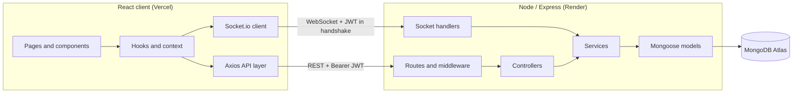
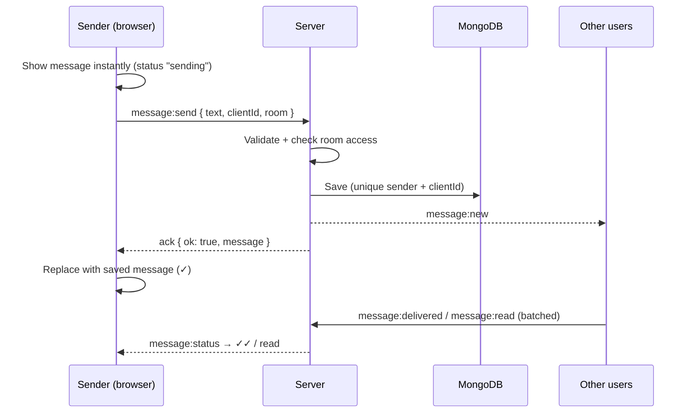

# Relay Chat

A real-time chat application built with **React**, **Node.js/Express**, **Socket.io** and **MongoDB**. Users join with a username and chat in a shared **General** channel or in private **one-to-one** conversations. Messages are delivered instantly, persisted, and survive page refreshes.

| | |
|---|---|
| **Live app** | https://YOUR-APP.vercel.app |
| **Backend API** | https://YOUR-API.onrender.com/api/health |
| **Screen recording** | [Google Drive link](https://drive.google.com/YOUR-LINK) |

> The backend runs on Render's free tier, which sleeps when idle. The first request after a while can take 30–50 seconds while the server wakes up.

---

## Features

**Core**
- Send and receive messages instantly through Socket.io (no polling)
- Chat history persists in MongoDB and loads after refresh
- Timestamp on every message, full date on hover or tap, and day separators (Today, Yesterday, date)
- REST API to send messages and fetch history, with cursor-based pagination
- Graceful handling of connections, disconnections, API errors and socket errors

**Bonus**
- Username-based login (dummy authentication with a signed JWT)
- Typing indicator ("ravi is typing…", "2 people are typing…")
- Online/offline status with "last seen", correct across multiple tabs
- Message status ticks: sending, sent, delivered, read
- MongoDB Atlas storage
- Deployed: backend on Render, frontend on Vercel

**Extra**
- One-to-one direct messages with server-side access control and unread badges
- Optimistic sending with retry for failed messages, plus a REST fallback when the socket is down
- Infinite scroll for older messages that keeps the scroll position steady
- Smart auto-scroll with a "new messages" button
- Connection banner (reconnecting, offline, back online) and toast notifications
- Light and dark themes (follows the system, with a manual toggle)
- Fully responsive: sidebar on desktop, slide-in drawer on mobile, safe-area aware
- Accessibility: labelled controls, visible focus, live regions, reduced-motion support

---

## Tech stack

| Layer | Technology |
|---|---|
| Frontend | React 19, Vite, Tailwind CSS v4, React Router, Axios, Socket.io client, dayjs, lucide-react |
| Backend | Node.js 20+, Express 5, Socket.io 4, Mongoose 9, Zod, jsonwebtoken, helmet, cors, express-rate-limit |
| Database | MongoDB Atlas |
| Hosting | Vercel (frontend), Render (backend) |

---

## Architecture



The backend is layered: **routes → controllers → services → models**. The REST controllers and the socket handlers are thin adapters that both call the same services, so business rules (validation, access control, saving, broadcasting) live in one place.

### Sending a message



---

## Project structure

```
.
├── client/                     React app (Vite)
│   └── src/
│       ├── api/                Axios instance with interceptors + one function per endpoint
│       ├── socket/             Socket.io client setup and emitWithAck helper
│       ├── context/            Auth, Socket and Toast providers
│       ├── hooks/              useMessages, useChatScroll, useTyping, usePresence,
│       │                       useReadReceipts, useUnreadCounts, useTheme, ...
│       ├── components/
│       │   ├── chat/           MessageList, MessageBubble, Composer, TypingIndicator, ...
│       │   ├── layout/         Sidebar, ChatHeader, ConnectionBanner
│       │   └── ui/             Button, IconButton, Avatar, Spinner, Toaster, Logo
│       ├── pages/              LoginPage, ChatPage
│       └── utils/              dates, message grouping, rooms, avatars, storage, validation
│
└── server/                     Express + Socket.io API
    └── src/
        ├── config/             env validation (Zod), db connection, constants
        ├── models/             User, Message (+ indexes)
        ├── services/           messageService, userService, presenceService
        ├── controllers/        REST controllers
        ├── routes/             /api/auth, /api/messages, /api/users
        ├── sockets/            socket setup, handshake auth, event handlers, ack wrapper
        ├── middleware/         auth, rate limiting, central error handler
        ├── validators/         Zod schemas
        ├── utils/              AppError, jwt, room helpers
        ├── app.js              Express app
        └── server.js           HTTP server, Socket.io, DB connection, graceful shutdown
```

---

## Getting started

### Prerequisites
- Node.js **20 or newer**
- A MongoDB connection string (a free MongoDB Atlas cluster or a local MongoDB)

### 1. Clone

```bash
git clone https://github.com/YOUR-USERNAME/YOUR-REPO.git
cd YOUR-REPO
```

### 2. Run the backend

```bash
cd server
npm install
cp .env.example .env      # then fill in MONGODB_URI and JWT_SECRET
npm run dev               # http://localhost:5050
```

Generate a JWT secret with:

```bash
node -e "console.log(require('crypto').randomBytes(32).toString('hex'))"
```

Check it's running: http://localhost:5050/api/health

### 3. Run the frontend

In a second terminal:

```bash
cd client
npm install
cp .env.example .env
npm run dev               # http://localhost:5173
```

Open http://localhost:5173 in two different browsers (or a normal and a private window), log in with two usernames and start chatting.

### Scripts

| Location | Command | Description |
|---|---|---|
| server | `npm run dev` | Start with auto-restart (`node --watch`) |
| server | `npm start` | Start for production |
| client | `npm run dev` | Vite dev server |
| client | `npm run build` | Production build to `dist/` |
| client | `npm run preview` | Preview the production build |
| client | `npm run lint` | Lint with Oxlint |

---

## Environment variables

### Server (`server/.env`)

| Variable | Required | Default | Description |
|---|---|---|---|
| `MONGODB_URI` | Yes | – | MongoDB connection string |
| `JWT_SECRET` | Yes | – | Secret for signing tokens (at least 32 characters) |
| `CLIENT_URL` | No | `http://localhost:5173` | Frontend URL allowed by CORS (REST and Socket.io) |
| `PORT` | No | `5050` | HTTP port |
| `NODE_ENV` | No | `development` | `development`, `production` or `test` |
| `JWT_EXPIRES_IN` | No | `7d` | Token lifetime |

All variables are validated with Zod at startup. If one is missing or invalid, the server exits immediately with a clear message.

### Client (`client/.env`)

| Variable | Required | Default | Description |
|---|---|---|---|
| `VITE_API_URL` | Yes in production | `http://localhost:5050` | Backend base URL, used for REST and Socket.io |

---

## REST API

Base URL: `/api`. Protected routes need the header `Authorization: Bearer <token>`.

Every response uses one of two shapes:

```json
{ "success": true, "data": { } }
{ "success": false, "error": { "code": "VALIDATION_ERROR", "message": "...", "details": [] } }
```

| Method | Endpoint | Auth | Description |
|---|---|---|---|
| GET | `/health` | – | Health check |
| POST | `/auth/login` | – | Body `{ username }`. Finds or creates the user and returns `{ token, user }`. Limited to 20 requests per 15 minutes per IP |
| GET | `/auth/me` | Yes | Returns the current user |
| GET | `/users` | Yes | All users with `lastSeen` |
| GET | `/messages` | Yes | Query `room` (default `general`), `before` (message id cursor), `limit` (1–50, default 30). Returns `{ messages, hasMore, nextCursor }`, oldest first |
| POST | `/messages` | Yes | Body `{ text, clientId, room? }`. Saves and broadcasts the message, returns `201 { message }`. Limited to 30 per minute per user |
| GET | `/messages/unread` | Yes | Unread count per conversation: `{ counts: { [room]: number } }` |

**Error codes:** `VALIDATION_ERROR`, `UNAUTHORIZED`, `FORBIDDEN`, `USER_NOT_FOUND`, `NOT_FOUND`, `INVALID_CURSOR`, `RATE_LIMITED`, `INVALID_JSON`, `PAYLOAD_TOO_LARGE`, `INTERNAL_ERROR`.

---

## Socket.io events

The client connects with `io(API_URL, { auth: { token } })`. A middleware verifies the JWT during the handshake and rejects invalid tokens. Each socket joins `general` and a private room `user:<userId>`, which is shared by all of that user's tabs.

Events with an acknowledgement reply with `{ ok: true, data }` or `{ ok: false, error: { code, message } }`.

| Event | Direction | Payload | Ack |
|---|---|---|---|
| `message:send` | client → server | `{ text, clientId, room? }` | `{ message }` |
| `message:new` | server → room members | `{ message }` | – |
| `message:delivered` | client → server | `{ messageIds: string[] }` (1–100) | `{ updated }` |
| `message:read` | client → server | `{ messageIds: string[] }` (1–100) | `{ updated }` |
| `message:status` | server → sender's `user:<id>` room | `{ updates: [{ messageId, deliveredTo, readBy }] }` | – |
| `typing:start` / `typing:stop` | client → server | `{ room }` | – |
| `typing:update` | server → other room members | `{ userId, username, room, isTyping }` | – |
| `presence:init` | server → connecting socket | `{ onlineUserIds }` | – |
| `presence:update` | server → everyone | `{ userId, username, online, lastSeen? }` | – |

---

## Design decisions

**One service layer for REST and sockets.** Sending a message by `POST /api/messages` or by `message:send` runs the same `createMessage` service, which validates, checks access, saves and broadcasts. There is no duplicated logic, and a REST send reaches every connected user in real time.

**Socket-first sending with a REST fallback.** The client sends through the already-open socket and waits for an acknowledgement (10-second timeout). If the socket is disconnected, it falls back to the REST endpoint.

**Optimistic UI and idempotent sends.** A message appears immediately with a client-generated `clientId` (UUID). A unique index on `(sender, clientId)` means a retry can never create a duplicate: the server returns the already-saved message. On the client, every update is merged by `clientId`, so the same message arriving from the ack, the broadcast or a reconnect sync is shown once.

**Cursor pagination instead of skip/limit.** History is requested with `before=<messageId>`, sorted by `(createdAt, _id)` and backed by the index `{ room, createdAt: -1, _id: -1 }`. Skip/limit gets slower on every page and shifts when new messages arrive, which causes duplicates or gaps. A cursor gives a stable, index-backed range query. Fetching `limit + 1` tells us whether more pages exist without a count query.

**Stateless JWT in a header, not a cookie.** The frontend and backend are on different domains. A Bearer token works the same way for REST and the socket handshake, and avoids cross-site cookie and CSRF setup. The trade-off is that a token in localStorage is readable by XSS, which is reduced by React's automatic escaping (no `dangerouslySetInnerHTML` anywhere).

**Presence per socket.** Online status is a `Map<userId, Set<socketId>>`. A user is online while at least one of their tabs is connected. Only the first connection broadcasts "online", and only the last disconnection broadcasts "offline" and saves `lastSeen`.

**Typing that never gets stuck.** The client throttles `typing:start` to once every 2 seconds and sends `typing:stop` after 3 seconds idle or on send. The server also clears typing after 5 seconds and on disconnect. Typing events are sent as volatile, so they are dropped rather than queued while offline.

**Batched receipts.** Delivered and read receipts are collected for 500 ms and sent as one event per batch. The server updates them with one `updateMany` and sends a single status event per sender. A message counts as **read** only when it is at least 60% on screen (IntersectionObserver) and the tab is visible (Page Visibility API).

**Direct messages without a conversations table.** A DM room id is built from the two sorted user ids (`dm:<idA>:<idB>`), so both users always get the same room. The server checks membership on every read, send, typing event and receipt. DM events go to both users' private `user:<id>` rooms.

**State management.** Auth, socket and toast state use React Context because they are global and change rarely. Chat state uses `useReducer` inside a hook, because it changes through well-defined events (history loaded, message received, status updated). Each conversation is rendered with `key={room}`, so switching chats starts with fresh state.

**Validation and security.** Zod validates every REST body, query and socket payload. helmet sets security headers, CORS is limited to the frontend URL, and JSON bodies are capped at 10 KB. Login and message sending are rate limited, on the socket as well as REST.

**Error handling.**
- Server: a custom `AppError` and one central error middleware that maps Zod, Mongoose, duplicate-key and body-parser errors to a consistent JSON shape. Unexpected errors are logged and returned as a generic 500. Every socket handler is wrapped so it always acknowledges and never crashes the process.
- Client: an Axios interceptor normalizes errors and logs out on 401. Around that sit inline error states, toasts, a connection banner, automatic reconnection with a resync of missed messages, retry for failed messages, and an error boundary.

---

## Assumptions

- Authentication is intentionally a demo login: any username signs in, with no password. Usernames are case-insensitive (`Ravi` and `ravi` are the same user), 3–20 characters, letters, numbers and underscores.
- There is one group channel (**General**) that every user belongs to, plus one-to-one direct messages. Custom group rooms are out of scope.
- In the group channel, "delivered" means at least one other user's app received the message, and "read" means at least one other user has seen it.
- Messages are plain text, up to 1000 characters. Editing, deleting and attachments are out of scope.
- The app runs as a single backend instance.

---

## Known limitations and future improvements

- **Horizontal scaling:** presence and Socket.io rooms are held in memory, so they only work with one server instance. Running several instances would need the Socket.io Redis adapter and presence stored in Redis.
- **Real authentication:** add passwords (bcrypt) or OAuth, refresh tokens, and httpOnly cookies if frontend and backend share a domain.
- **Reconnect gap:** after a reconnect the client re-fetches the latest page (30 messages). A longer outage could leave a gap until the user scrolls up.
- **Group read receipts:** show who has read a message ("Seen by ravi, priya"), not only that someone has.
- **More features:** group rooms with members, message edit/delete, reactions, file uploads, search, push notifications.
- **Testing:** unit tests for services and reducers, and integration tests for REST and socket flows (Vitest, Supertest, socket.io-client).
- **Cold starts:** the free Render instance sleeps when idle, so the first request can be slow.
